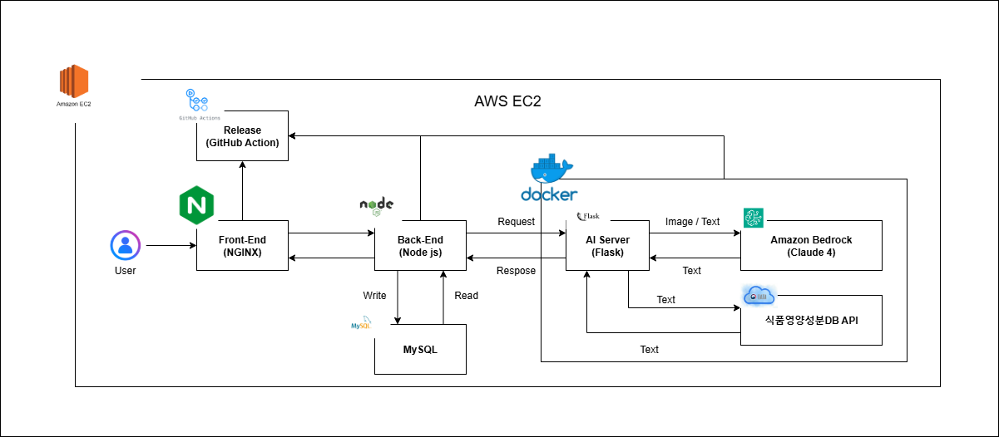

# Eaten 🍎 : AI 기반 영양 분석 및 건강 관리 플랫폼

Amazon Q Developer을 활용한 음식 사진 분석 및 개인 맞춤형 건강 관리 서비스입니다.

## 📋 목차

- [프로젝트 개요](#-프로젝트-개요)
- [주요 기능](#-주요-기능)
- [기술 스택](#-기술-스택)
- [시스템 아키텍처](#-시스템-아키텍처)
- [빠른 시작](#-빠른-시작)
- [개발 환경 설정](#-개발-환경-설정)
- [API 문서](#-api-문서)
- [배포](#-배포)
- [프로젝트 구조](#-프로젝트-구조)
- [기여하기](#-기여하기)
- [라이선스](#-라이선스)

## 프로젝트 개요

Eaten은 사용자가 업로드한 음식 사진을 AI로 분석하여 영양 정보를 제공하고, 개인의 식습관 데이터를 바탕으로 건강 리포트와 맞춤형 식사 추천을 제공하는 종합 영양 관리 플랫폼입니다.

### 주요 특징

- **AI 기반 음식 인식**: vLLM을 활용한 정확한 음식 분석
- **실시간 영양 분석**: 사진 업로드 즉시 상세한 영양 정보 제공
- **개인 맞춤형 리포트**: 7일간의 식습관 데이터 기반 건강 분석
- **스마트 식사 추천**: AI가 분석한 영양 부족분을 고려한 메뉴 제안
- **바코드 스캔**: 가공식품 바코드 인식을 통한 간편한 영양 정보 입력

## 주요 기능

### 음식 사진 분석
- 업로드된 음식 사진을 AI로 분석하여 예상 제공량 및 상세 영양 정보 제공
- 가공식품/간식 여부 자동 판별
- 다중 음식 인식 지원
- 식품의약품안전처 식품 영양 성분DB 기반 분석결과 제공

### 건강 리포트 생성
- 7일간의 식사 데이터 종합 분석
- 식사 패턴 및 가공식품 섭취 비율 분석
- 개인별 권장량 대비 실제 섭취량 비교
- 개인 맞춤형 건강 개선 방안 제시

### 스마트 식사 추천
- 부족한 영양소 파악 및 보완 방안 제시
- 실용적이고 구체적인 식사 메뉴 추천
- 개인의 활동량과 신체 정보를 고려한 맞춤형 추천

### 바코드 분석
- 가공식품 바코드 스캔을 통한 즉시 영양 정보 입력
- 제품 데이터베이스 연동으로 정확한 영양 성분 제공

### 통계 및 시각화
- 일별/주별 영양 섭취 현황 차트
- 권장량 대비 섭취 비율 시각화

## 기술 스택

### Frontend
- **React** - 사용자 인터페이스
- **Vite** - 빌드 도구 및 개발 서버
- **Tailwind CSS** - 스타일링
- **React Router** - 클라이언트 사이드 라우팅
- **Axios** - HTTP 클라이언트
- **Chart.js** - 데이터 시각화

### Backend
- **Node.js & Express** - 서버 프레임워크
- **MySQL** - 관계형 데이터베이스
- **Passport.js** - 카카오 OAuth 인증
- **Multer** - 파일 업로드 처리
- **Axios** - AI 서버 통신

### AI/ML
- **Python Flask** - AI 서버
- **Amazon Bedrock** - Claude 4 Sonnet 모델

### DevOps & Infrastructure
- **GitHub Actions** - CI/CD 파이프라인
- **AWS EC2** - 서버 호스팅
- **AWS CloudFront** - CDN
- **Docker** - 컨테이너화
- **Nginx** - 웹 서버 및 리버스 프록시

## 시스템 아키텍처

<div align="center">
  
</div>

## 서비스 시연

### 사용자 정보 입력
<div align="center">
  
</div>

### 음식 사진 분석
<div align="center">
  
</div>

### 식사 분석 리포트
<div align="center">
  
</div>

### 통계 및 건강 리포트
<div align="center">
  
</div>

### 사전 요구사항
- Node.js 18+ 
- Python 3.8+
- MySQL 8.0+
- AWS 계정 (Bedrock 액세스 권한)

### 1. 저장소 클론
```bash
git clone https://github.com/Hayoung5/FizzBuzz_Eaten.git
cd FizzBuzz_Eaten
```

### 2. 데이터베이스 설정
```bash
# MySQL 데이터베이스 생성
mysql -u root -p < database/schema.sql
mysql -u root -p < database/dummy_data.sql
```

### 3. 백엔드 설정
```bash
cd backend
npm install

# 환경변수 설정
cp .env.example .env
# .env 파일에 데이터베이스 및 JWT 설정 입력

# 서버 실행
npm start
```

### 4. AI 서버 설정
```bash
cd AI
pip install -r requirements.txt

# AWS 자격증명 설정
export AWS_ACCESS_KEY_ID=your_access_key
export AWS_SECRET_ACCESS_KEY=your_secret_key
export AWS_DEFAULT_REGION=us-east-1

# AI 서버 실행
python run_server.py
```

### 5. 프론트엔드 설정
```bash
cd ..  # 프로젝트 루트로 이동
npm install

# 개발 서버 실행
npm run dev
```

### 6. 접속
- 프론트엔드: http://localhost:3001
- 백엔드 API: http://localhost:3000
- AI 서버: http://localhost:5000

## 개발 환경 설정

### 환경변수 설정

#### Backend (.env)
```env
# 데이터베이스
DB_HOST=localhost
DB_USER=root
DB_PASSWORD=your_password
DB_NAME=fizzbuzz_eaten

# JWT
JWT_SECRET=your_jwt_secret_key

# 카카오 OAuth
KAKAO_CLIENT_ID=your_kakao_client_id
KAKAO_CLIENT_SECRET=your_kakao_client_secret

# AI 서버
AI_SERVER_URL=http://localhost:5000
```

#### AI Server (.env)
```env
# AWS Bedrock
AWS_ACCESS_KEY_ID=your_aws_access_key
AWS_SECRET_ACCESS_KEY=your_aws_secret_key
AWS_DEFAULT_REGION=us-east-1

# Flask
FLASK_ENV=development
FLASK_DEBUG=True
```

### 개발 스크립트

```bash
# 프론트엔드 개발 서버
npm run dev

# 백엔드 개발 서버 (nodemon)
cd backend && npm run dev

# AI 서버 개발 모드
cd AI && python run_server.py

# 프론트엔드 빌드
npm run build

# 린팅
npm run lint
```

## 📚 API 문서

### 주요 엔드포인트

| 엔드포인트 | 메소드 | 설명 |
|-----------|--------|------|
| `/api/auth/kakao` | GET | 카카오 로그인 |
| `/api/user_info` | POST | 사용자 정보 등록 |
| `/api/user_info/:id` | GET | 사용자 정보 조회 |
| `/api/photo_analy` | POST | 음식 사진 분석 |
| `/api/barcode_analy` | POST | 바코드 분석 |
| `/api/statistics` | GET | 사용자 통계 조회 |
| `/api/report` | GET | 건강 리포트 조회 |
| `/api/meal_reco` | GET | 식사 추천 |

## 배포

### GitHub Actions를 통한 자동 배포

프로젝트는 GitHub Actions를 통해 자동으로 배포됩니다:

- **Frontend**: AWS CloudFront + S3
- **Backend**: AWS EC2
- **AI Server**: AWS EC2

### 수동 배포

#### 프론트엔드 배포
```bash
npm run build
# dist 폴더를 S3에 업로드 후 CloudFront 무효화
```

#### 백엔드 배포
```bash
cd backend
# EC2 서버에 코드 배포 후 PM2로 프로세스 관리
pm2 start src/app.js --name "fizzbuzz-backend"
```

#### AI 서버 배포
```bash
cd AI
# EC2 서버에 배포
python run_server.py
```

## 📁 프로젝트 구조

```
FizzBuzz_Eaten/
├── 📁 src/                          # 프론트엔드 소스코드
│   ├── 📁 components/               # React 컴포넌트
│   ├── 📁 pages/                    # 페이지 컴포넌트
│   ├── 📁 services/                 # API 서비스
│   └── 📁 styles/                   # 스타일 파일
├── 📁 backend/                      # 백엔드 소스코드
│   ├── 📁 src/
│   │   ├── 📁 controllers/          # API 컨트롤러
│   │   ├── 📁 models/               # 데이터 모델
│   │   ├── 📁 routes/               # 라우트 정의
│   │   ├── 📁 services/             # 비즈니스 로직
│   │   ├── 📁 middleware/           # 미들웨어
│   │   └── 📁 config/               # 설정 파일
│   └── 📄 package.json
├── 📁 AI/                           # AI 서버 소스코드
│   ├── 📄 app.py                    # Flask 애플리케이션
│   ├── 📄 bedrock_service.py        # AWS Bedrock 서비스
│   ├── 📄 run_server.py             # 서버 실행 스크립트
│   └── 📁 images/                   # 테스트 이미지
├── 📁 database/                     # 데이터베이스 스키마 및 더미 데이터
├── 📁 deploy/                       # Docker 배포 설정
├── 📁 .github/workflows/            # GitHub Actions CI/CD
├── 📄 frontend-api-spec.md          # API 명세서
├── 📄 ai-server-api-spec.md         # AI 서버 API 명세서
└── 📄 README.md
```

**Eaten** - AI로 더 건강한 식습관을 만들어가세요!
